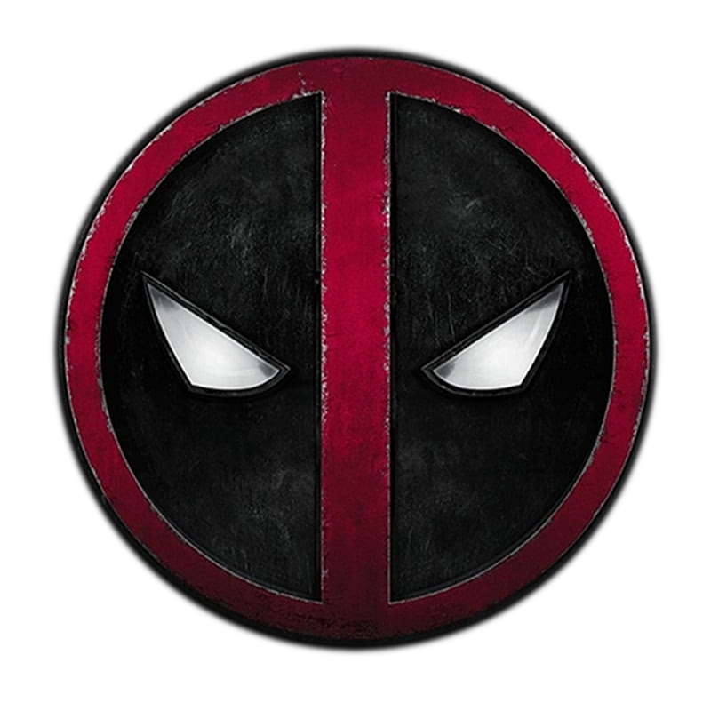
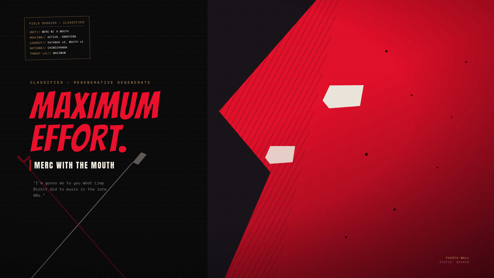

<p align="center">
  
</p>

<h1 align="center">Omarchy Deadpool Theme</h1>

<p align="center">
  A dark, blood-red <a href="https://omarchy.org">Omarchy</a> theme for anyone who runs their desktop at maximum effort.
</p>

<p align="center">
  
</p>

## Installation

**Option 1: Omarchy TUI**

Open the theme menu (`Super + Ctrl + Shift + Space` by default) and choose **Install**, then paste this repo's URL.

**Option 2: Omarchy CLI**

```bash
omarchy theme install https://github.com/shadesdude66/omarchy-deadpool-theme.git
```

This clones the theme into `~/.config/omarchy/themes/deadpool` and applies it automatically.

**Option 3: Manual clone**

```bash
git clone https://github.com/shadesdude66/omarchy-deadpool-theme.git ~/.config/omarchy/themes/deadpool
omarchy theme set Deadpool
```

## What's included

- `colors.toml` — accent red/black palette used across the terminal, Hyprland, and Waybar
- `icons.theme` — Yaru-red icon set
- `backgrounds/maximum-effort.jpg` — theme wallpaper

## Uninstall

```bash
omarchy theme remove Deadpool
```
